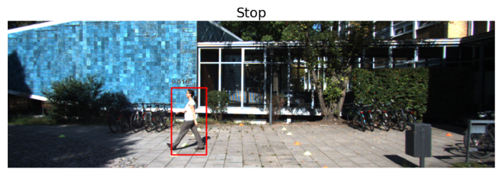
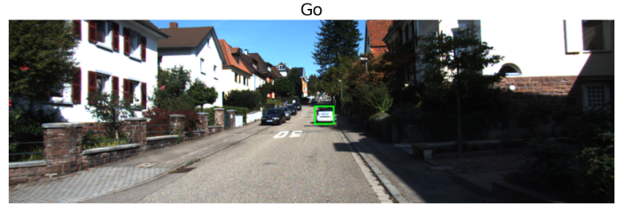

### Object Detection "Go", "Stop" 판단 시스템 

**KITTI** 데이터셋의 이미지를 사용해서 차량이 가깝거나 행인이 보이는 경우 "Stop"을 return하고 그 외에 경우에는 "Go"를 return하게 만들었습니다.

### keras-retinanet 

모델을 훈련할 수 있는 공통된 데이터셋 포맷인 CSV 형태로 모델을 변경해주는 방법을 사용해서 **tensorflow dataset**의 KITTI 데이터셋을 학습합니다.

#### Stop  :   

 

#### Go  :   

